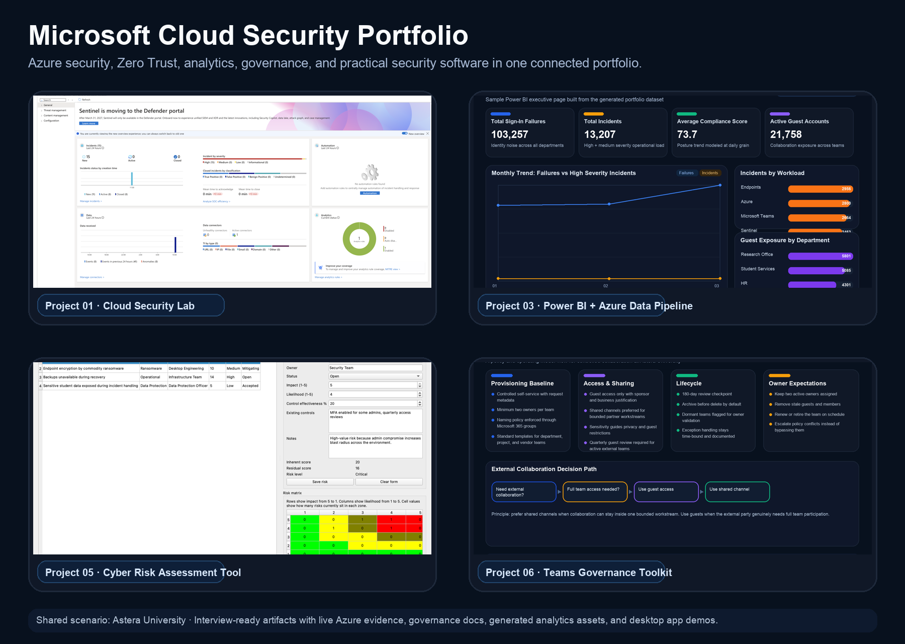

# Microsoft Cloud Security Portfolio

[](https://github.com/QueenKM/microsoft-cloud-security-portfolio/actions/workflows/docs-quality.yml)
[](./LICENSE)

This repository is a structured portfolio workspace for six Microsoft and Azure focused projects. The goal is to build a strong, interview-ready body of work that demonstrates cloud security, architecture, governance, data analytics, and practical software delivery.

## Quick Links

- flagship live lab: [Project 01](projects/01-cloud-security-lab/README.md)
- architecture blueprint: [Project 02](projects/02-zero-trust-architecture-blueprint/README.md)
- analytics story: [Project 03](projects/03-power-bi-azure-data-pipeline/README.md)
- practical app build: [Project 05](projects/05-cyber-risk-assessment-tool/README.md)
- M365 governance pack: [Project 06](projects/06-teams-governance-toolkit/README.md)

## Portfolio Preview



## Portfolio Goals

- Build one flagship Azure security lab with real detections and response flows.
- Show architectural thinking through Zero Trust documentation and threat modeling.
- Demonstrate analytics skills through a Power BI and Azure data pipeline project.
- Prove infrastructure automation skills with Bicep and Terraform.
- Stand out with a practical desktop cyber risk assessment tool.
- Add Microsoft 365 governance depth with a Teams governance toolkit.

## Recommended Storyline

Use one fictional organization across the whole portfolio so every project feels connected instead of random. This repo uses `Astera University` as the common scenario: a mid-sized institution with cloud identities, remote users, regulated data, student collaboration needs, and a small security team.

See [docs/portfolio-scenario.md](docs/portfolio-scenario.md) for the shared assumptions.

## Project Map

| Project | Focus | Main Skills | Cert Alignment |
| --- | --- | --- | --- |
| `01-cloud-security-lab` | Secure Azure sandbox | Entra ID, Sentinel, Defender for Cloud, KQL, alerts, RBAC | `SC-100`, `SC-200`, `SC-300` |
| `02-zero-trust-architecture-blueprint` | Security architecture repo | Zero Trust, diagrams, decision logs, STRIDE | `SC-100`, `AZ-305` |
| `03-power-bi-azure-data-pipeline` | Analytics project | Data modeling, ETL, DAX, dashboards | `PL-300` |
| `04-azure-iac` | Infrastructure automation | Terraform, Bicep, GitHub Actions | `AZ-104`, `AZ-305` |
| `05-cyber-risk-assessment-tool` | Practical security software | Python GUI, risk scoring, PDF/Excel export | Security + software portfolio |
| `06-teams-governance-toolkit` | M365 governance repo | Teams policies, retention, guest access | `MS-700` |

## Current Snapshot

| Project | Current Status | Best Visible Artifact |
| --- | --- | --- |
| `01-cloud-security-lab` | Live Azure sandbox deployed, evidence capture in progress | Sentinel and Azure Monitor screenshots |
| `02-zero-trust-architecture-blueprint` | Blueprint docs, decisions, and STRIDE model in place | Architecture diagrams and policy pack |
| `03-power-bi-azure-data-pipeline` | Dataset, star schema, DAX pack, and dashboard preview ready | `02-dashboard-preview.png` |
| `04-azure-iac` | Bicep landing zone and monitoring baseline implemented | subscription-scope Bicep baseline |
| `05-cyber-risk-assessment-tool` | Runnable PySide6 MVP with exports and demo screenshot | `01-main-dashboard.png` |
| `06-teams-governance-toolkit` | Governance pack and policy assets ready | `02-governance-overview.png` |

## Featured Previews

### Cloud Security Lab


### Cyber Risk Assessment Tool


## Suggested Build Order

1. Start with the Azure foundation in `01-cloud-security-lab`.
2. Capture architecture decisions in `02-zero-trust-architecture-blueprint`.
3. Reuse logs and operational data in `03-power-bi-azure-data-pipeline`.
4. Automate baseline infrastructure in `04-azure-iac`.
5. Build the desktop app in `05-cyber-risk-assessment-tool`.
6. Finish with governance documentation in `06-teams-governance-toolkit`.

## Repo Structure

```text
microsoft-cloud-security-portfolio/
├── docs/
├── shared-assets/
└── projects/
    ├── 01-cloud-security-lab/
    ├── 02-zero-trust-architecture-blueprint/
    ├── 03-power-bi-azure-data-pipeline/
    ├── 04-azure-iac/
    ├── 05-cyber-risk-assessment-tool/
    └── 06-teams-governance-toolkit/
```

## What "Done" Looks Like

Each project should eventually contain:

- A clear `README` with purpose, architecture, and setup instructions.
- Screenshots, diagrams, or demo artifacts.
- Reproducible steps or infrastructure definitions.
- A short "business value" section for recruiters and interviewers.
- A short "lessons learned" section showing reflection.

## Planning Docs

- [docs/roadmap.md](docs/roadmap.md)
- [docs/project-tracker.md](docs/project-tracker.md)
- [docs/decision-log-template.md](docs/decision-log-template.md)
- [docs/threat-model-template.md](docs/threat-model-template.md)

## Repository Standards

- Documentation stays in English for public portfolio readability.
- Sample data, screenshots, and exports must be anonymized before upload.
- Markdown links inside the repository should use relative paths so they work in GitHub.
- New additions should include recruiter-facing business value, not only technical notes.

## Contributing

See [CONTRIBUTING.md](CONTRIBUTING.md) for branch, documentation, and review expectations.

## Next Move

The best first implementation step is to build the baseline of `01-cloud-security-lab` and let that project produce identities, logs, alerts, and security controls that can feed the rest of the portfolio.
