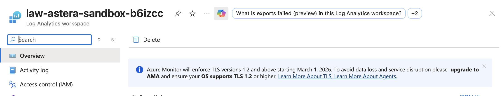
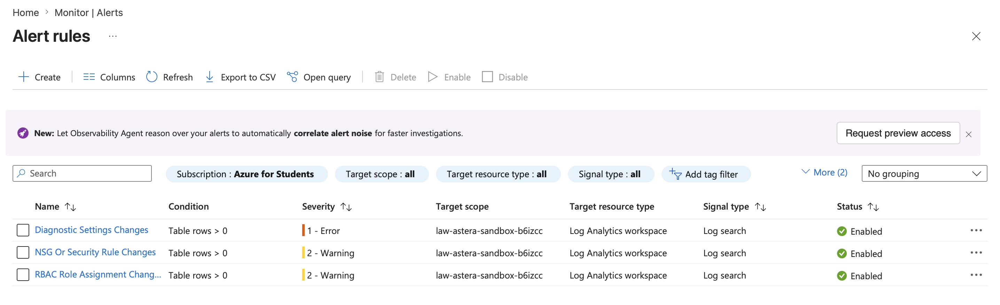
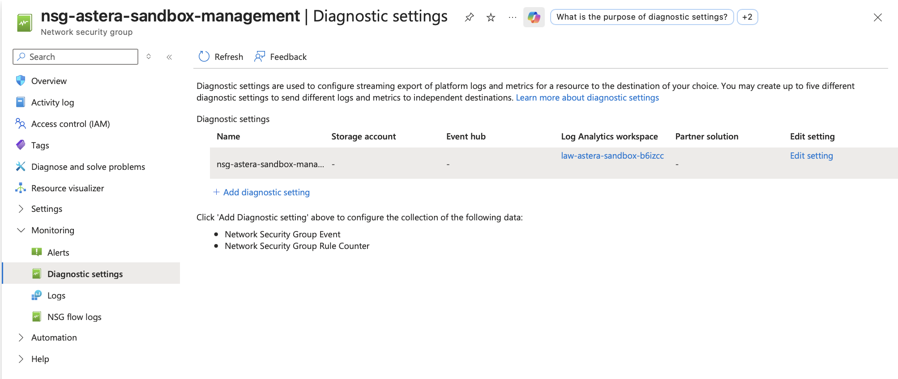
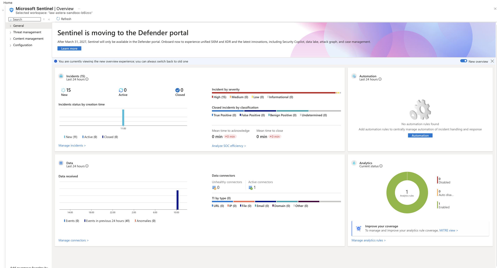
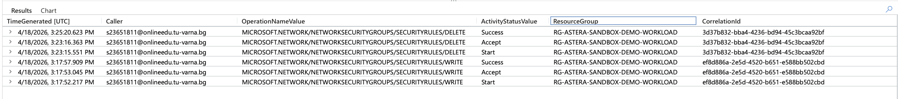
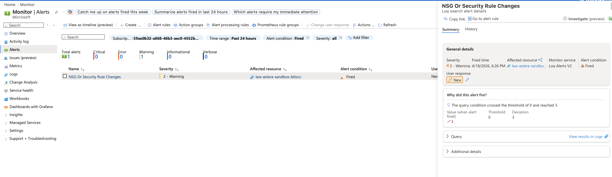

# Project 01: Cloud Security Lab

## Goal

Build an end-to-end Azure security lab in a sandbox subscription that demonstrates identity protection, monitoring, detection, and response.

## Why This Project Matters

This is the flagship project in the portfolio. It shows hands-on execution with Microsoft security tooling and creates the strongest interview story for cloud security roles.

## Current Status

`Live validation complete`

The baseline environment is now live in an `Azure for Students` subscription in `Sweden Central`. Core monitoring, diagnostics, alerting, `AzureActivity` validation, and `Microsoft Sentinel` onboarding are completed. Conditional Access validation is currently blocked by `Microsoft Entra` privileges.

See:

- [Live Sandbox Status](docs/live-sandbox-status.md)
- [Artifacts](artifacts/README.md)

## Quick Links

- [Architecture Overview](docs/architecture.md)
- [Portal Execution Checklist](docs/portal-execution-checklist.md)
- [Alert Strategy](docs/alert-strategy.md)
- [Demo Checklist](docs/demo-checklist.md)
- [Incident Walkthrough](docs/incident-walkthrough.md)
- [Live Sandbox Status](docs/live-sandbox-status.md)
- [Artifacts](artifacts/README.md)

## At A Glance

| Area | Status |
| --- | --- |
| Azure baseline deployment | Live |
| Log Analytics workspace | Live |
| Azure Monitor alert rules | Live |
| NSG and storage diagnostics | Live |
| Microsoft Sentinel onboarding | Live |
| `AzureActivity` detection proof | Validated live |
| Azure Monitor fired alert proof | Validated live |
| Conditional Access validation | Blocked by tenant privileges |

## Core Scope

- Entra ID tenant hardening
- Conditional Access baseline
- RBAC and least privilege design
- Defender for Cloud onboarding
- Sentinel SIEM deployment
- Log Analytics workspace and alerts
- simulated attack activity such as failed sign-ins or password spraying
- detection and response workflow

## Recommended Tech

- Azure subscription sandbox
- Microsoft Entra ID
- Azure Monitor and Log Analytics
- Microsoft Defender for Cloud
- Microsoft Sentinel
- KQL
- optional Logic Apps playbook for response automation

## Deliverables

- architecture diagram
- security baseline document
- KQL queries and analytic rules
- alert and incident screenshots
- attack simulation walkthrough
- incident response playbook

## Starter Docs

- [Implementation Plan](docs/implementation-plan.md)
- [Architecture Overview](docs/architecture.md)
- [Alert Strategy](docs/alert-strategy.md)
- [Demo Checklist](docs/demo-checklist.md)
- [Portal Execution Checklist](docs/portal-execution-checklist.md)
- [Incident Walkthrough](docs/incident-walkthrough.md)
- [Screenshot Runbook](docs/screenshot-runbook.md)
- [Tenant And Subscription Boundaries](docs/tenant-subscription-boundaries.md)
- [RBAC Model](docs/rbac-model.md)
- [Conditional Access Matrix](docs/conditional-access-matrix.md)
- [Sentinel Onboarding Checklist](docs/sentinel-onboarding-checklist.md)
- [Starter KQL Detections](docs/kql-detections.md)
- [Safe Attack Simulation Plan](docs/attack-simulation.md)
- [Live Sandbox Status](docs/live-sandbox-status.md)

## Live Evidence Highlights

The first live screenshots already captured for this project include:

- Log Analytics workspace overview
- Azure Monitor alert rules list
- RBAC alert rule overview
- NSG diagnostic settings
- storage blob diagnostic settings
- subscription activity log export
- Sentinel overview
- Sentinel data connectors
- KQL proof of NSG write and delete activity in `AzureActivity`
- fired `NSG Or Security Rule Changes` alert in `Azure Monitor`

These files are tracked in [artifacts/screenshots](artifacts/screenshots).

## Evidence Gallery

### Log Analytics Workspace

### Azure Monitor Alert Rules

### NSG Diagnostics

### Sentinel Overview

### KQL Detection Proof

### Fired Alert Proof

## Build Phases

1. Create the sandbox structure and define admin roles.
2. Configure identity protections and Conditional Access.
3. Onboard Defender for Cloud, Sentinel, and logging.
4. Simulate suspicious activity and document detections.
5. Polish the repo with screenshots, lessons learned, and business value.

## Evidence To Capture

- Conditional Access policy screens
- Defender secure score or recommendations
- Sentinel incident queue
- RBAC assignment model
- attack timeline from event to response

## Known Constraints

- `Conditional Access` is currently blocked by insufficient `Microsoft Entra` privileges in the student tenant.
- `SigninLogs` evidence may remain unavailable unless the tenant later exposes the required `Entra` telemetry and permissions.

## Cert Alignment

`SC-100`, `SC-200`, `SC-300`
