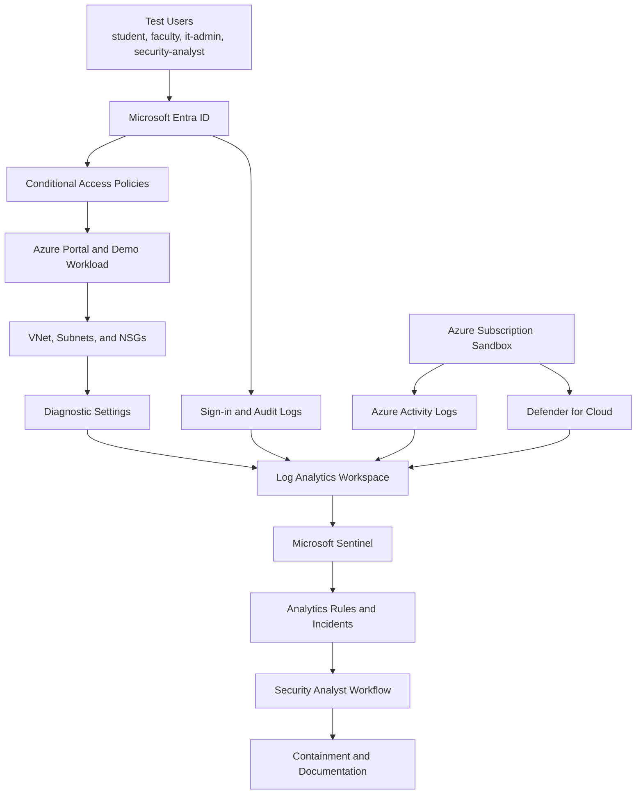

# Cloud Security Lab Architecture Overview

## Goal

This architecture provides a small but realistic Microsoft security lab for `Astera University`. It is designed to show identity protection, centralized logging, posture management, detection, and basic incident response in a sandbox environment.

## Design Principles

- keep the scope small enough to afford and explain
- center the design around identity and monitoring
- separate operational roles with least privilege
- make detections and screenshots easy to reproduce
- prefer reusable building blocks that can later be automated with IaC

## High-Level Diagram

## Core Components

### Identity Layer

- `Microsoft Entra ID` for users, groups, and administrative roles
- `Conditional Access` for access enforcement and MFA requirements
- dedicated lab accounts for testing user and admin scenarios

### Monitoring Layer

- `Log Analytics workspace` as the central data platform
- `Microsoft Sentinel` for analytics rules, incidents, and investigations
- `Azure Monitor` alerting for platform events and operational signals

### Security Posture Layer

- `Defender for Cloud` for secure score, recommendations, and workload posture
- diagnostic settings on key resources to push platform logs into the workspace

### Demo Workload Layer

- one low-cost Azure workload, starting with an optional Linux VM
- optional storage account for sample logging and basic hardening examples

### Network Layer

- one sandbox `VNet` with management and workload subnets
- `NSG`s attached at subnet level for future workload controls
- service endpoints ready for basic storage-connected scenarios

## Resource Group Layout

| Resource Group | Purpose | Example Resources |
| --- | --- | --- |
| `rg-identity-monitoring` | Monitoring and log collection | Log Analytics workspace, alerts |
| `rg-security-operations` | Security tooling and workflow resources | Sentinel content, playbooks |
| `rg-demo-workload` | Test workload for diagnostics and posture checks | VNet, NSGs, VM, App Service, storage |

## Data Flow Summary

1. Test users authenticate through `Entra ID`.
2. `Conditional Access` evaluates risk and control requirements.
3. Network and storage diagnostic settings send supported platform logs into `Log Analytics`.
4. Sign-in, audit, and Azure activity logs flow into `Log Analytics`.
5. `Defender for Cloud` contributes recommendations and posture data.
6. `Microsoft Sentinel` correlates events and raises incidents.
7. The analyst investigates workload, platform, and identity signals together.
8. The analyst performs a documented response in the sandbox.

## Why This Design Works For A Portfolio

- It is realistic enough to discuss in interviews.
- It maps clearly to `SC-100`, `SC-200`, and `SC-300`.
- It produces reusable outputs such as policies, detections, screenshots, and incident stories.
- It can later be reproduced in `04-azure-iac`.
