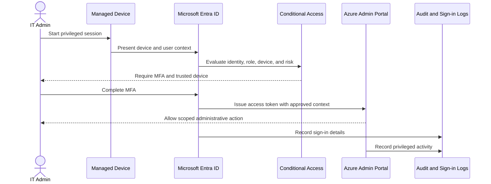

# Identity And Device Access Flow

## Reading Guide

- the user does not reach the admin portal directly
- policy evaluation happens before sensitive access is granted
- privileged sessions generate both identity and activity evidence
