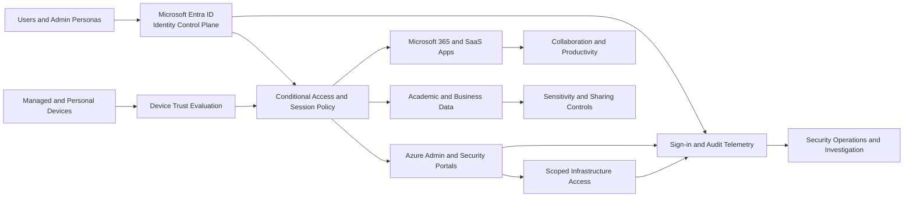

# Zero Trust Reference Diagram

## Reading Guide

- identities and devices both feed access evaluation
- application and admin access paths are protected differently
- telemetry flows back into the security operations layer
- data protection sits behind identity, device, and app decisions
