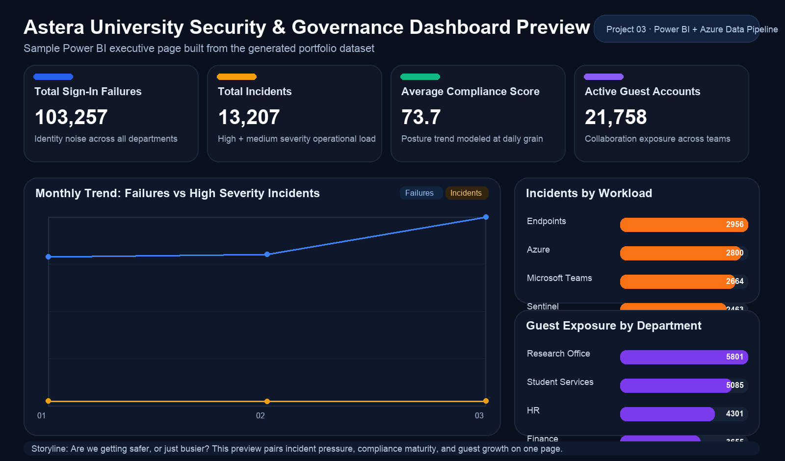

# Project 03: Power BI + Azure Data Pipeline

## Goal

Build an end-to-end analytics project that turns operational security and governance signals from the wider portfolio into a clean Power BI semantic model and dashboard story.

## Why This Project Matters

This project proves that the portfolio is not just about controls and infrastructure. It shows how to transform raw operational data into KPIs, trends, and decisions that an analyst, service owner, or university leadership team can actually use.

## Chosen Scenario

The dataset models `Astera University` daily security and collaboration operations across:

- `Entra ID`
- `Sentinel`
- `Microsoft Teams`
- `Azure`
- `Endpoints`

It combines security and governance metrics such as:

- sign-in failures
- high and medium severity incidents
- privileged role changes
- active guest accounts
- Teams lifecycle activity
- compliance score trend
- risky devices
- data loss events

## Recruiter Value

- shows practical star schema thinking
- demonstrates KPI design and DAX fluency
- connects cloud security data to executive reporting
- creates an interview-ready analytics story tied to the rest of the portfolio

## Quick Links

- [Business Questions](docs/business-questions.md)
- [Star Schema](docs/star-schema.md)
- [Power Query Transformations](docs/power-query-transformations.md)
- [DAX Measures](docs/dax-measures.md)
- [Dashboard Design](docs/dashboard-design.md)
- [Dashboard Wireframe](artifacts/01-dashboard-wireframe.md)

## Project Structure

- sample dataset generator: [scripts/generate_sample_dataset.py](scripts/generate_sample_dataset.py)
- generated CSV model: [data](data)
- business questions: [docs/business-questions.md](docs/business-questions.md)
- star schema design: [docs/star-schema.md](docs/star-schema.md)
- Power Query approach: [docs/power-query-transformations.md](docs/power-query-transformations.md)
- DAX catalogue: [docs/dax-measures.md](docs/dax-measures.md)
- dashboard design brief: [docs/dashboard-design.md](docs/dashboard-design.md)
- demo checklist: [docs/demo-checklist.md](docs/demo-checklist.md)
- SQL DDL: [sql/star-schema.sql](sql/star-schema.sql)
- dashboard preview generator: [scripts/generate_dashboard_preview.py](scripts/generate_dashboard_preview.py)
- visible artifacts: [artifacts](artifacts)

## Data Model

The semantic model uses one primary fact table at the grain:

```text
one row per Date x Department x Workload
```

Dimensions:

- `DimDate`
- `DimDepartment`
- `DimWorkload`

Fact table:

- `FactSecurityGovernanceDaily`

## Dataset Snapshot

| Table | Purpose | Approximate Size |
| --- | --- | --- |
| `dim_date.csv` | Calendar slicing and time intelligence | 90 rows |
| `dim_department.csv` | Business ownership and risk tier | 5 rows |
| `dim_workload.csv` | Workload drilldown | 5 rows |
| `fact_security_governance_daily.csv` | KPI-ready operational fact table | 2250 rows |

## Key Business Questions

- Which departments have the highest operational security load?
- Are sign-in failures trending faster than compliance improvements?
- Which workloads create the most high-severity incidents?
- Where is guest access growing faster than lifecycle cleanup?
- Which areas show elevated privileged change activity?

## Visible Artifact

The project includes a GitHub-friendly dashboard wireframe and a rendered preview image so the reporting story is visible even before a `.pbix` file is added.



## How To Use The Dataset

1. Generate or refresh the sample CSVs:

```bash
python3 scripts/generate_sample_dataset.py
```

1. Render the dashboard preview artifact:

```bash
python3 scripts/generate_dashboard_preview.py
```

1. Open `Power BI Desktop`.
2. Import the CSV files from [data](data).
3. Build relationships according to [docs/star-schema.md](docs/star-schema.md).
4. Add measures from [docs/dax-measures.md](docs/dax-measures.md).
5. Recreate the dashboard layout described in [docs/dashboard-design.md](docs/dashboard-design.md).

## Generated Files

After running the generator, you will have:

- `dim_date.csv`
- `dim_department.csv`
- `dim_workload.csv`
- `fact_security_governance_daily.csv`
- `artifacts/02-dashboard-preview.png`

## Official References

- [Star schema guidance for Power BI](https://learn.microsoft.com/en-us/power-bi/guidance/star-schema)
- [Model relationships in Power BI Desktop](https://learn.microsoft.com/en-us/power-bi/transform-model/desktop-create-and-manage-relationships)
- [Quickstart: Learn DAX basics](https://learn.microsoft.com/en-us/power-bi/transform-model/desktop-quickstart-learn-dax-basics)
- [What is Power Query?](https://learn.microsoft.com/en-us/power-query/power-query-what-is-power-query)

## Cert Alignment

`PL-300`
