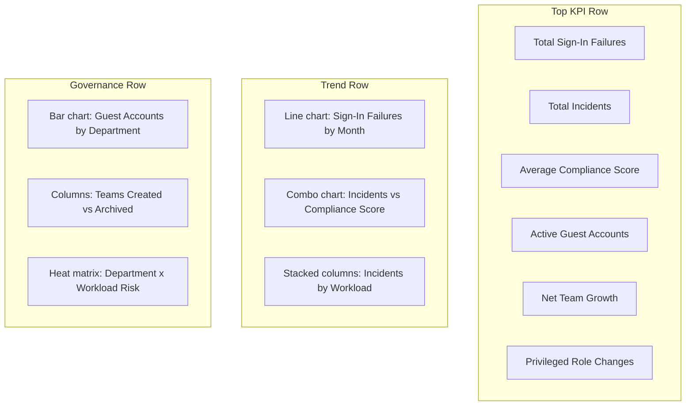

# Dashboard Wireframe

## Reporting Story

The dashboard should quickly show whether operational noise is increasing faster than control maturity. If sign-in failures, high-severity incidents, and guest growth rise while compliance score stays flat, the university is becoming busier without becoming safer.
