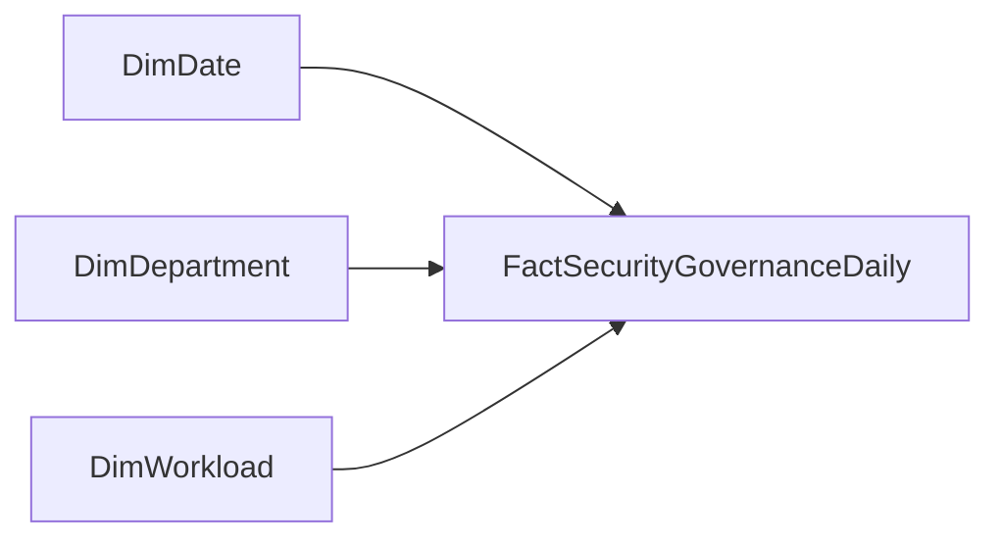

# Star Schema

## Model Overview

The model uses a classic star schema with one central fact table and three dimensions.



## Grain

`FactSecurityGovernanceDaily` is stored at:

```text
one row per Date x Department x Workload
```

This makes it easy to:

- aggregate by day, month, quarter, or year
- filter by department or workload
- calculate ratios and trends without mixing event-level noise

## Tables

## DimDate

Primary key:

- `DateKey`

Useful attributes:

- `Date`
- `Year`
- `Quarter`
- `MonthNumber`
- `MonthName`
- `WeekNumber`
- `DayOfWeek`
- `IsWeekend`

## DimDepartment

Primary key:

- `DepartmentKey`

Attributes:

- `DepartmentName`
- `RiskTier`
- `ExecutiveOwner`

## DimWorkload

Primary key:

- `WorkloadKey`

Attributes:

- `WorkloadName`
- `PlatformDomain`
- `PrimaryPersona`

## FactSecurityGovernanceDaily

Foreign keys:

- `DateKey`
- `DepartmentKey`
- `WorkloadKey`

Measures-ready columns:

- `SignInFailures`
- `HighSeverityIncidents`
- `MediumSeverityIncidents`
- `PrivilegedRoleChanges`
- `GuestAccountsActive`
- `TeamsCreated`
- `TeamsArchived`
- `ComplianceScore`
- `RiskyDevices`
- `DataLossEvents`

## Relationship Pattern

Use single-direction filtering from each dimension into the fact table:

- `DimDate[DateKey]` -> `FactSecurityGovernanceDaily[DateKey]`
- `DimDepartment[DepartmentKey]` -> `FactSecurityGovernanceDaily[DepartmentKey]`
- `DimWorkload[WorkloadKey]` -> `FactSecurityGovernanceDaily[WorkloadKey]`

## Why This Model Works

- It keeps DAX simpler than a denormalized flat table.
- It supports drilldown by time, department, and workload.
- It reflects how analytics teams commonly model KPI-heavy operational reporting.
