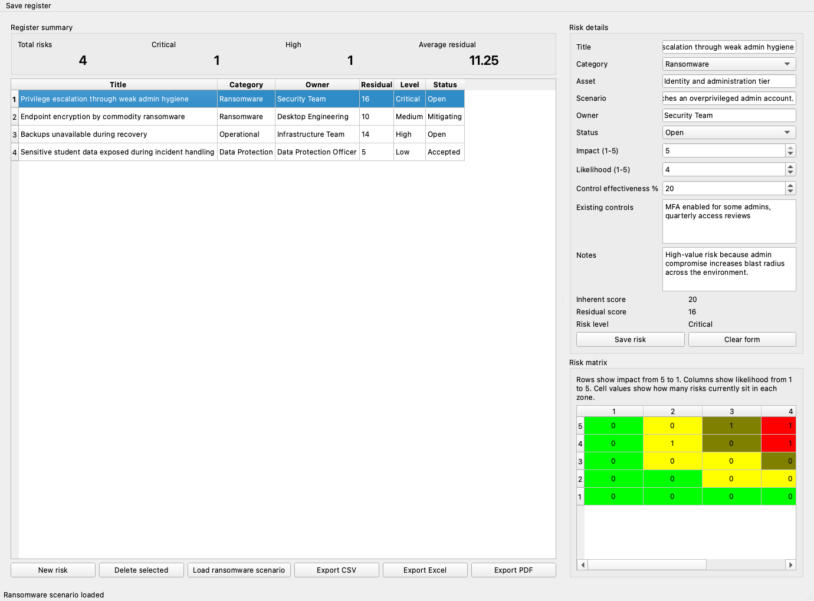

# Project 05: Cyber Risk Assessment Tool

## Goal

Build a desktop application that helps users score cyber risks using impact and likelihood, visualize a risk matrix, and export results for reporting.

## Why This Project Matters

This is one of the most distinctive projects in the portfolio because it combines security knowledge with actual software delivery. It is practical for university work, useful in demonstrations, and strong on a CV because it shows product thinking rather than only cloud configuration.

## Current Status

`MVP complete and demo-ready`

The first runnable version uses `Python` and `PySide6` to provide:

- a local risk register
- impact, likelihood, and control-effectiveness scoring
- residual risk calculation
- a live 5x5 risk matrix
- a sample ransomware scenario pack
- JSON persistence and multi-format reporting export

## Screenshot Preview



## Quick Links

- [Architecture Note](docs/architecture.md)
- [Demo Checklist](docs/demo-checklist.md)
- [User Guide](docs/user-guide.md)
- [Sample Scenario Pack](data/ransomware_scenario.json)
- [Artifacts](artifacts/README.md)

## Stack

- `Python`
- `PySide6`
- local `JSON` storage
- `CSV`, `XLSX`, and `PDF` export

## Run

Create or activate a Python environment, then install requirements:

```bash
python3 -m pip install -r requirements.txt
```

Start the app:

```bash
python3 app/main.py
```

Optional smoke test:

```bash
QT_QPA_PLATFORM=offscreen python3 app/main.py --smoke-test
```

## MVP Features

- create, edit, and delete risk entries
- score risks on a 1 to 5 impact and likelihood scale
- apply control-effectiveness weighting to calculate residual risk
- classify risks as `Low`, `Medium`, `High`, or `Critical`
- load a sample `ransomware` scenario pack
- export the current register to `CSV`, `Excel`, and `PDF`
- save the register locally between sessions

## Feature Snapshot

| Capability | Current State |
| --- | --- |
| Local risk register | Working |
| Residual risk scoring | Working |
| 5x5 matrix visualization | Working |
| Sample ransomware scenario | Working |
| CSV export | Working |
| PDF export | Working |
| Excel export | Working |

## Demo Artifacts

- [Generated screenshot](artifacts/01-main-dashboard.png)
- [Generated CSV export](artifacts/01-risk-register-export.csv)
- [Generated Excel export](artifacts/01-risk-register-export.xlsx)
- [Generated PDF export](artifacts/01-risk-register-export.pdf)
- [Artifacts note](artifacts/README.md)

## Project Structure

- [Application Entry Point](app/main.py)
- [Risk Model](app/models.py)
- [Scoring Engine](app/scoring.py)
- [Persistence Layer](app/storage.py)
- [Sample Scenario Pack](data/ransomware_scenario.json)
- [Architecture Note](docs/architecture.md)
- [Demo Checklist](docs/demo-checklist.md)
- [User Guide](docs/user-guide.md)

## Evidence To Capture

- main dashboard with risk table
- risk matrix view
- ransomware scenario loaded in the register
- exported `CSV`, `Excel`, and `PDF` examples
- short architecture note

## Optional Future Enhancements

- add filtering and sorting for larger registers
- add richer risk treatment workflow
- package the app for easier demo use

## Portfolio Value

This project helps you talk about security from both an analyst and builder perspective. It shows that you can take a risk-management concept and turn it into a usable application with real UX and data handling.
