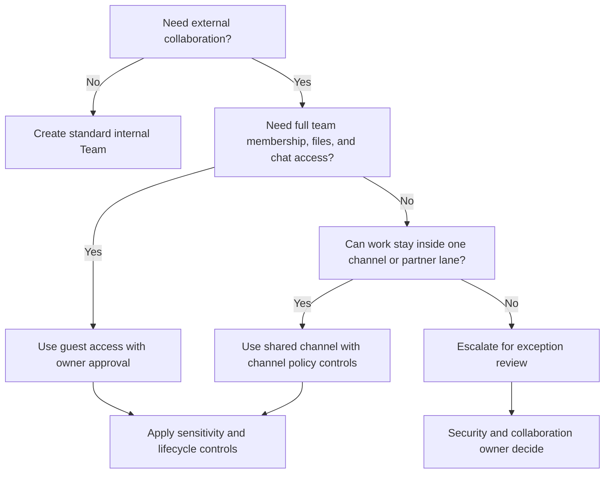
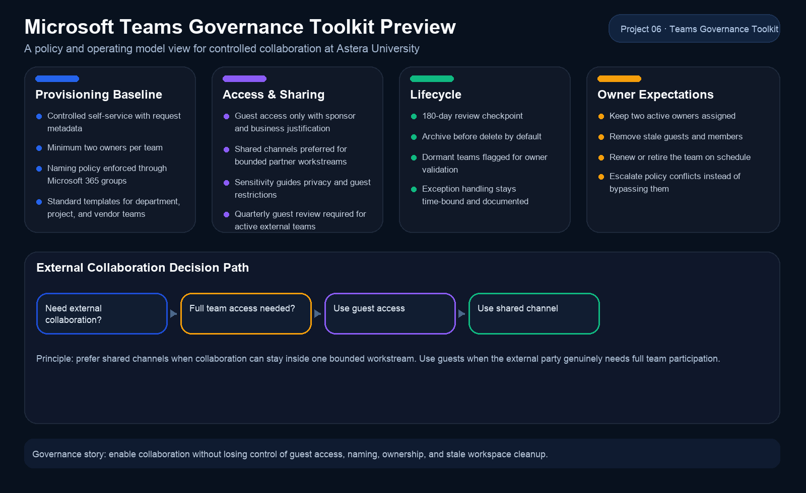

# Project 06: Microsoft Teams Governance Toolkit

## Goal

Create a practical Microsoft Teams governance repository for `Astera University` that enables collaboration without losing control of guest access, naming, lifecycle, retention, and ownership.

## Why This Project Matters

This project shows that the portfolio goes beyond pure cloud deployment work. It demonstrates policy design, operating model thinking, and the ability to turn Microsoft 365 governance guidance into reusable artifacts that admins and business owners can actually follow.

## Recruiter Value

- shows Microsoft 365 and Teams governance depth
- connects security controls to business-friendly operating rules
- demonstrates architect-style thinking, not just portal execution
- creates reusable runbooks, templates, and approval patterns for `MS-700` style scenarios

## Governance Position

The toolkit assumes that uncontrolled self-service collaboration creates three common risks:

- inconsistent or misleading team names
- unmanaged guest access and shared channel sprawl
- stale teams that remain discoverable long after the business need ends

The design therefore favors:

- controlled self-service over blanket admin-only provisioning
- sensitivity labels over one-off manual exceptions
- lifecycle reviews over permanent team ownership
- simple owner responsibilities over heavy centralized gatekeeping

## Toolkit Components

- [Governance Policy Pack](docs/governance-policy-pack.md)
- [Operating Model](docs/operating-model.md)
- [Implementation Checklist](docs/implementation-checklist.md)
- [Owner Quick Start](docs/owner-quick-start.md)
- [Lifecycle Checklist](docs/lifecycle-checklist.md)
- [Exception Process](docs/exception-process.md)
- [Demo Checklist](docs/demo-checklist.md)
- [Guest Access Decision Tree](diagrams/guest-access-decision-tree.md)
- [Team Request Template](templates/team-request-template.md)
- [Quarterly Review Template](templates/team-review-template.md)
- [Governance One-Pager](artifacts/01-governance-one-pager.md)
- governance preview generator: [scripts/generate_governance_preview.py](scripts/generate_governance_preview.py)

## Governance Snapshot

| Area | Baseline |
| --- | --- |
| Team creation | Controlled self-service with standard request metadata |
| Naming | Prefix by business unit and workspace type, blocked words list enabled |
| Guest access | Allowed by default only for approved collaboration scenarios |
| Shared channels | Preferred for limited external collaboration where full guest membership is unnecessary |
| Sensitivity | Labels define privacy and guest rules for higher-risk workspaces |
| Lifecycle | 180-day review and renewal checkpoint, archive before delete |
| Retention | Channel/chat retention handled in Purview and documented at request time |
| Ownership | Minimum two owners per team, owner review required each quarter |

## Example Decision Flow

## Visible Artifacts

- policy one-pager for interview walkthroughs: [01-governance-one-pager.md](artifacts/01-governance-one-pager.md)
- decision tree for guest versus shared channel use: [guest-access-decision-tree.md](diagrams/guest-access-decision-tree.md)
- owner-facing operational guidance: [owner-quick-start.md](docs/owner-quick-start.md)

## Assumptions And Constraints

- The fictional tenant uses Microsoft 365, Teams, SharePoint, Entra ID, and Purview capabilities.
- Feature availability can vary by tenant configuration and licensing, so the toolkit separates policy intent from licensing-specific implementation detail.
- The repository is written as an architecture and governance deliverable rather than a fully automated tenant configuration pack.

## Official References

- [Plan for governance in Teams](https://learn.microsoft.com/en-us/microsoftteams/plan-teams-governance)
- [Guest access in Microsoft Teams](https://learn.microsoft.com/en-us/microsoftteams/guest-access)
- [Set expiration for Microsoft 365 groups](https://learn.microsoft.com/en-us/entra/identity/users/groups-lifecycle)
- [Group naming policy quickstart](https://learn.microsoft.com/en-us/entra/identity/users/groups-quickstart-naming-policy)
- [Sensitivity labels for Microsoft Teams](https://learn.microsoft.com/en-us/microsoftteams/sensitivity-labels)
- [Learn about retention policies and labels](https://learn.microsoft.com/en-us/purview/retention)
- [Shared channels in Microsoft Teams](https://learn.microsoft.com/en-us/microsoftteams/shared-channels)
- [Manage channel policies in Microsoft Teams](https://learn.microsoft.com/en-us/microsoftteams/teams-policies)
- [Archive or delete a team in Microsoft Teams](https://learn.microsoft.com/en-us/microsoftteams/archive-or-delete-a-team)

## Cert Alignment

`MS-700`
