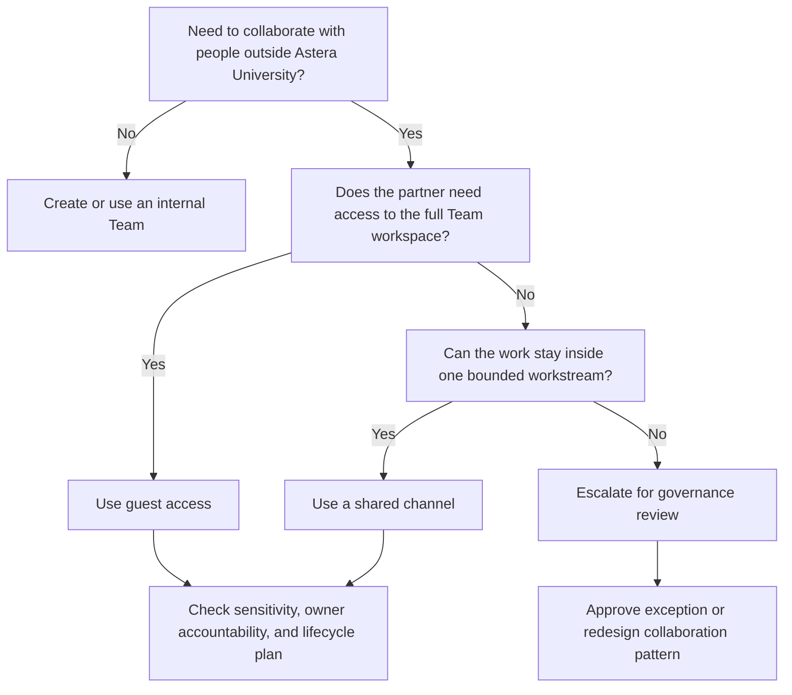

# Guest Access Decision Tree

## Reading The Diagram

- choose `guest access` when the external user needs broad participation in the team
- choose `shared channel` when the collaboration should stay inside one scoped lane
- choose `governance review` when neither option cleanly matches the policy baseline
